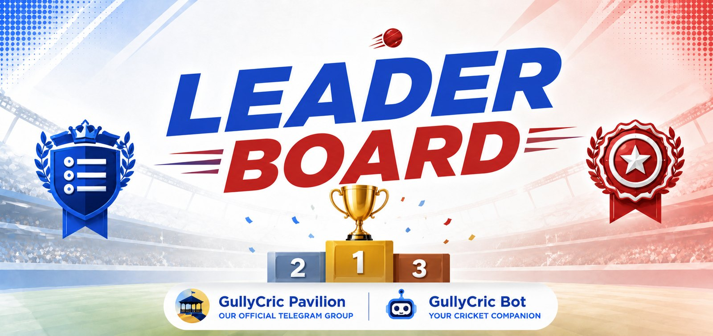

  
  <h1>GullyCric Bot</h1>
  
<b>Telegram Hand-Cricket • Live Scorecards • IPL-Style Tournaments</b>

  
  
  
   
  

---

## 🏏 The Core Duel
GullyCric brings street hand-cricket to Telegram[cite: 1]. The bowler hides a number (0–6) in the bot's DM, and the batter guesses in the group[cite: 1]. Match the number, and you're out. Survive, and you score[cite: 1]!

---

## 🎮 Game Modes

### Solo Mode

A fast-paced free-for-all[cite: 1]. Everyone takes a turn batting while the rest of the group bowls[cite: 1].
* **Live Tracking:** Watch the runs, balls, and wickets update in real-time as the strike rotates[cite: 1].

### Team Mode

The flagship GullyCric experience[cite: 1]. Two teams, one toss, and a Super Over if the match ends in a tie[cite: 1]. Features captains, tactical dot balls, and mid-match substitutions[cite: 1].

### Tournaments

Run full IPL-style leagues across your groups[cite: 1]. The bot fully automates registered rosters, group stages, live NRR points tables, and playoff brackets[cite: 1].

---

## 📈 Stats, Economy & Glory

* **Rubies Economy:** Earn in-game currency for centuries, hat-tricks, and tournament wins[cite: 1]. Use Rubies to place bets on live matches[cite: 1]!
* **Global Leaderboards:** Fight for the Orange and Purple caps, track your career stats, and secure your place in the Hall of Fame[cite: 1].

---

  <h3>Ready to play?</h3>
  
Add the bot to your group, type <code>/startcricket</code>, and you're bowling in seconds.

  <a href="https://t.me/GullyCricPavilion"><b>@GullyCricPavilion</b></a> • <a href="https://t.me/GullyCricTournaments"><b>@GullyCricTournaments</b></a>

